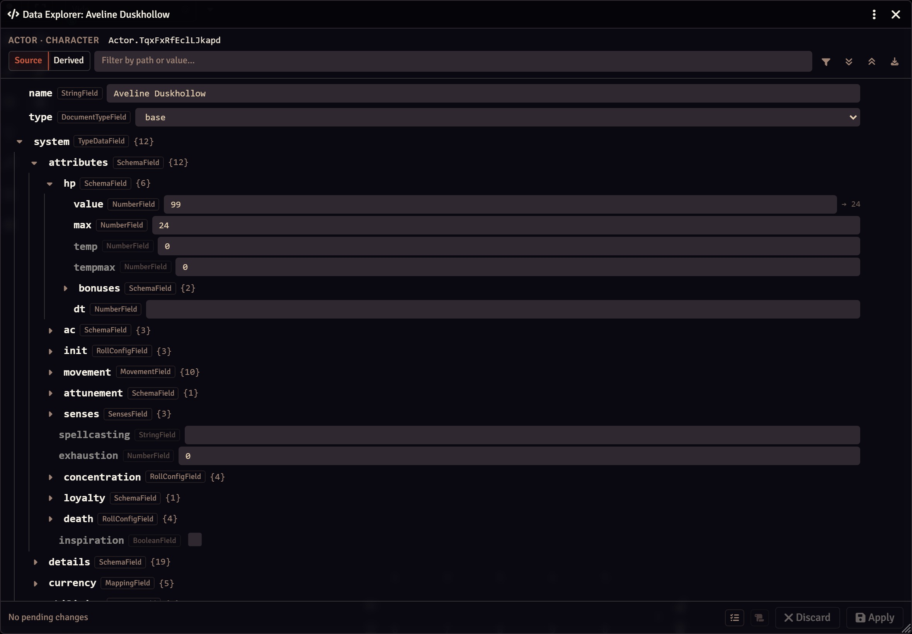
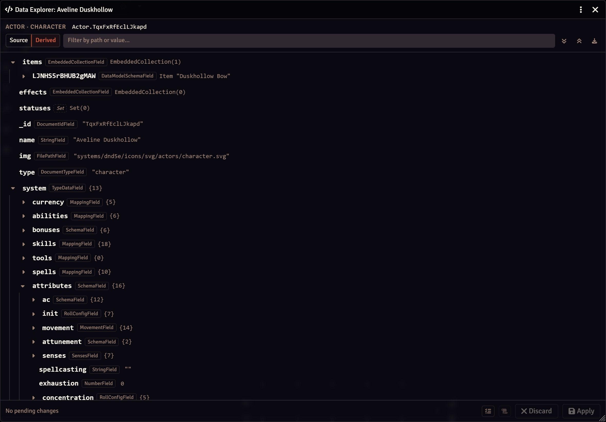
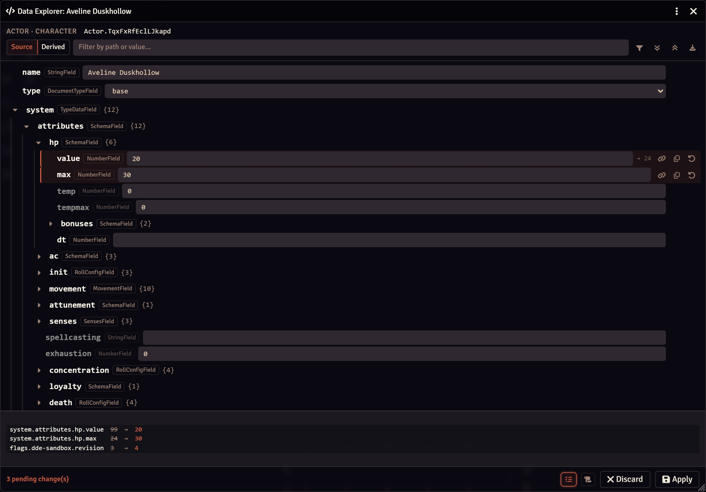
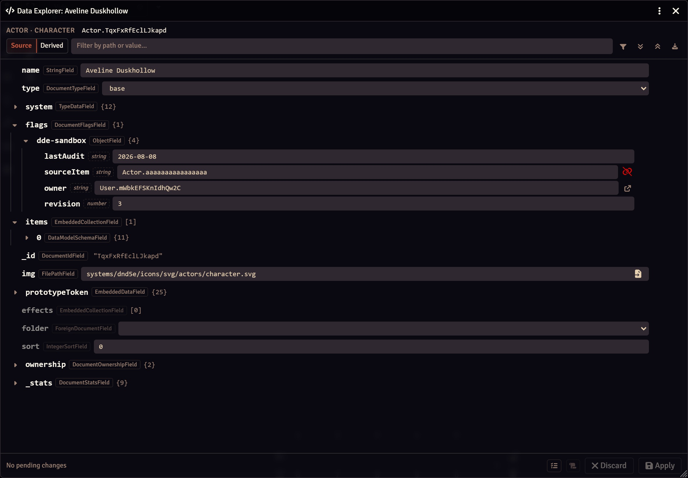

# Document Data Explorer

A Foundry VTT module that adds a **Data Explorer** control to every document sheet, in the header's
`⋮` controls menu. It opens a window that walks the document's data structure, shows what each
property is declared as in the schema, and lets a GM edit, add, or remove values.

Built for anyone who has ever opened the console just to run
`game.actors.getName("…").system.attributes.hp`, or to fix a value a broken macro left behind.

> **Compatibility:** Foundry VTT **v14** (verified 14.365).
> **Access:** GM only. The button is not rendered for other users.



---

## What it does

**Explore the structure.** Every property of the document is listed as a collapsible tree. Each row
shows the key, the declared `DataField` type, and the value. Hovering the type chip reveals the
field's metadata: required, nullable, read-only, allowed range, and default value. Properties that
belong to no schema (module flags, loosely-typed system data) are marked with a dashed chip so
you can tell declared data from free-form data at a glance.

**Two views.**

| View | Shows | Editable |
| --- | --- | --- |
| **Source** | `document.toObject()`, exactly what is stored in the database | Yes |
| **Derived** | The live document after data preparation, including everything the system computes | No |

The derived view is where you find values that exist only in memory, like a system's calculated
armour class. They are read-only because nothing writes them back.



*The derived view of the same character. `system` holds thirteen keys here against twelve in storage,
and `attributes` sixteen against twelve: the extras are computed, never saved.*

You rarely need to switch, though: whenever a stored value and its prepared value disagree, the
source row shows the prepared one beside it in grey. Store `99` hit points on a character capped at
`24` and the row reads `99 → 24`. It is the single most common source of confusion in Foundry data,
answered without leaving the view.

**See what was actually set.** Every field a schema declares is present in stored data, filled in by
Foundry at creation, so a document is mostly defaults. The filter button hides every property still
holding exactly what its schema would have put there, leaving only what somebody deliberately set.
Rows with pending edits are never hidden.

**Edit safely.** Editing widgets are built by the field itself through `DataField#toInput`, so a
field with `choices` renders a select, a `FilePathField` renders a file picker, a `BooleanField`
renders a checkbox, and so on. Values are coerced with `DataField#clean` and checked with
`DataField#validate`, which surfaces the error inline before anything is sent.

**Nothing is written until you apply.** Edits are staged: changed rows are highlighted, the footer
counts them, and `Apply` sends a single update. `Discard` throws the batch away. If the document is
changed elsewhere while you have pending edits, the window reloads and tells you.

`Apply` refuses to run while any staged value fails its field's validation, and names the offending
path. Foundry logs a rejected update and then quietly drops it, so without that check the window
would report a success that never reached the database.

**Review before you commit.** The review panel lists every staged change as `path: stored → pending`,
deletions included, and refreshes as you keep editing.



**Turn a fix into a macro.** Beside it, one button copies the whole batch as a runnable script:

```js
const doc = await fromUuid("Actor.FYttyXXjnrEQbBeQ");
await doc.update({
  "flags.my-module.-=stale": null
});
await doc.update({
  "system.attributes.hp.value": 20,
  "system.attributes.hp.max": 40
});
```

It is generated from the same payloads `Apply` sends, in the same order, so what you paste into a
macro is exactly what the button would have done, now repeatable across other documents.

**Beyond simple values.**

- **Add a property** to any free-form object (flags, unschemaed system data) or append to an array.
- **Remove a property**, sent as Foundry's `-=key` deletion, or as an array splice.
- **Edit as raw JSON** for any object or array, with an option to replace it entirely rather than
  merge into it.
- **Follow and check references.** Values pointing at another document (declared `ForeignDocumentField`
  and `DocumentUUIDField` properties, and free-form strings shaped like a UUID, which is how module
  flags usually store them) get a link that opens the target in its own explorer. A reference that
  resolves to nothing is flagged in red instead, which is how a removed compendium or an uninstalled
  module announces the rubble it left behind.
- **Open embedded documents** (items, active effects, journal pages…) in their own explorer, since
  they must be updated through their own document rather than through the parent.
- **Filter** by path or value, which reveals only the matching branches.
- **Copy** a property path, a value, or the document UUID; **download** the whole source as JSON.



*Free-form flags carry a dashed type chip. `owner` resolves and offers to open its target, while
`sourceItem` points at a document that no longer exists and is flagged in red.*

---

## Installation

Paste this manifest URL into Foundry's *Add-on Modules → Install Module* dialog:

```
https://github.com/JDR-Ninja/fvtt-document-data-explorer/releases/latest/download/module.json
```

Or clone the repository straight into your Foundry `Data/modules` directory:

```bash
git clone https://github.com/JDR-Ninja/fvtt-document-data-explorer.git document-data-explorer
```

The directory name must be `document-data-explorer` to match the module id.

---

## Usage

1. Open any document sheet: an actor, an item, a journal entry, a scene, a roll table…
2. Click the `⋮` button in the window header and pick **Data Explorer**.
3. Expand what you need, edit it, and press **Apply**.

Sheets still built on the V1 Application framework (deprecated since core v13, slated for removal
in v16) get a plain **Data Explorer** button in their header instead, since V1 has no controls
menu. Everything past that point behaves identically.

The explorer can also be opened from a macro or the console:

```js
game.modules.get("document-data-explorer").api.open(game.actors.getName("Alice"));
```

---

## Things worth knowing

- **Arrays are replaced whole.** Foundry cannot update an array through a dotted path, so any edit
  inside an array is sent as a replacement of the entire array. This is a Foundry constraint, not a
  choice made here.
- **Schema keys cannot be deleted.** Removing a key that the schema declares would simply reinstate
  it at its default on the next update, so the delete action is offered only for free-form keys and
  array members. Use *Revert* to return a declared field to its stored value.
- **Objects merge by default.** Foundry's update merges objects rather than replacing them. The JSON
  editor offers *Replace entirely* when you want the missing keys gone; it sends the deletion first,
  then the new value.
- **Embedded documents are read-only in the parent.** Open them in their own explorer to edit.
- **The derived view is a snapshot.** It is rebuilt on each render, not live-bound.

---

## Development

Plain ES modules: no build step, no dependencies.

```
scripts/
  main.js       Hook registration and the sheet header control
  explorer.js   The ApplicationV2 window: rendering, staging, applying
  tree.js       The node model for the source and derived views
  schema.js     DataField introspection, widget building, coercion, validation
  util.js       Constants and small helpers
```

## License

[MIT](LICENSE)
